## Azure Logic Apps

El logic apps, se mantiene en funcionamiento todo el tiempo, se ejecuta cada ves que lo mandas a llamar.

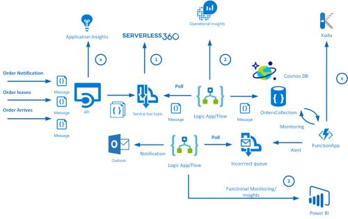

- **Modelo de Servicio:** PaaS - Serverless.
- **cobro:** Cobra por evento y tamaño, practicamente cada que lo usas o lo llamas te cobrara por hora.
- **Funcion:** Es igual a Azure Functions pero con entorno visual.
- **Funcion:** Enfocado a automatizacion de proceso de negocio.
- **Caracteristicas:** Conectores pre-establecidos y conectores personalizables.

----------------------------------------------------------------------------------------------------

### Pasos para la creacion de un Logic App

1.- Abrir el [Portal de Azure](https://portal.azure.com/).

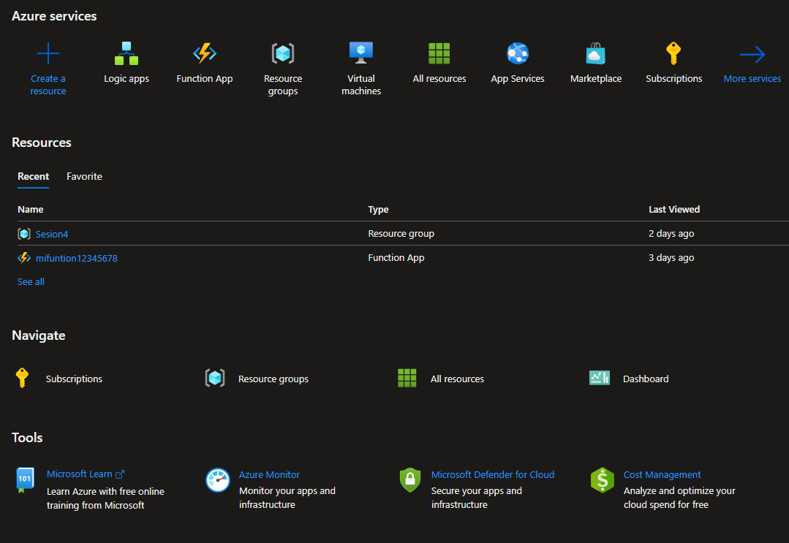

2.- buscar azure logic apps.

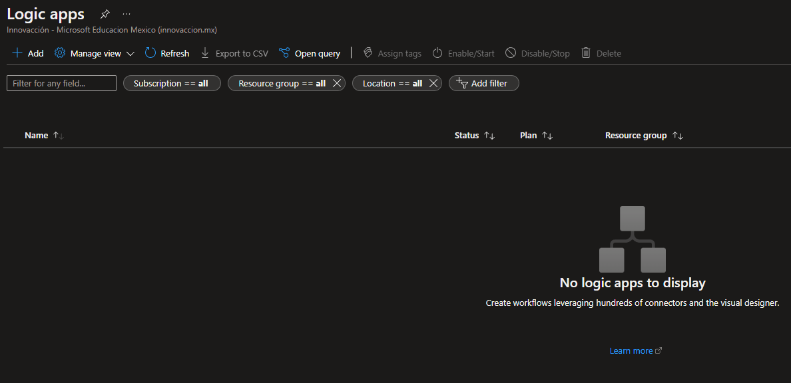

3.- crear una aplicacion .

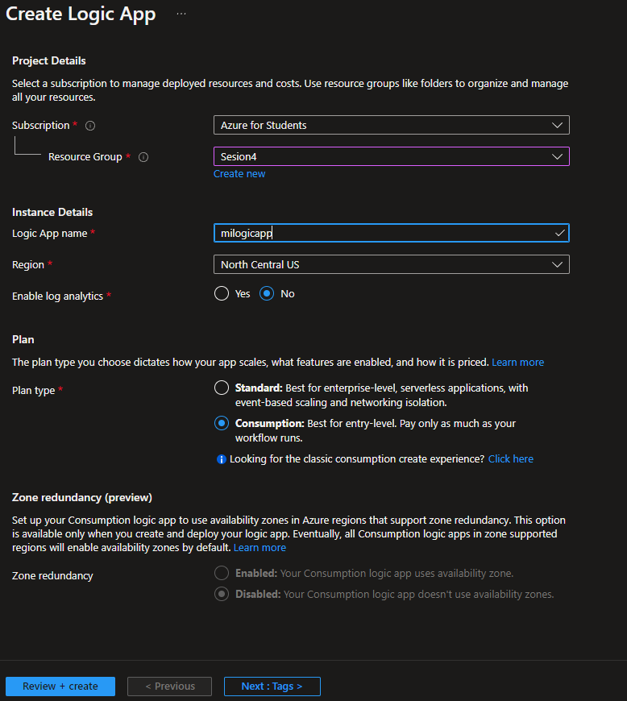

4.- Creas un grupo o seleccionas un grupo de recursos tuyo.

5.- Le das un nombre a la aplicacion.

6.- En tipo de plan le daremos: **consumo**.

7.- Ahora, le damos en revisar y Crea para que posteriormente, creemos el logic app.

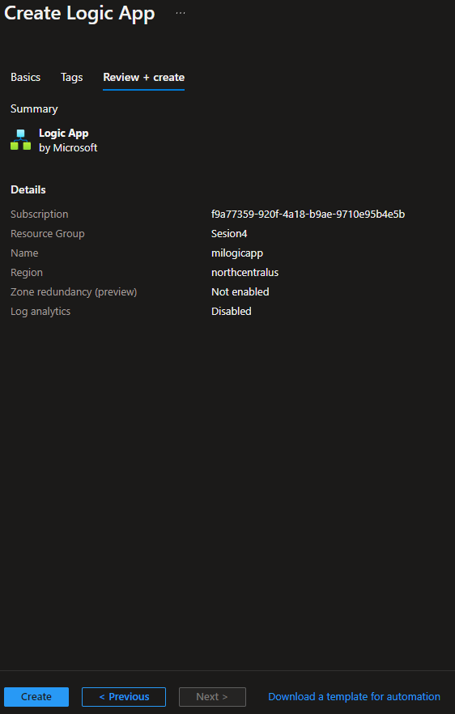

8.- Ahora solo esperamos a que se cree.

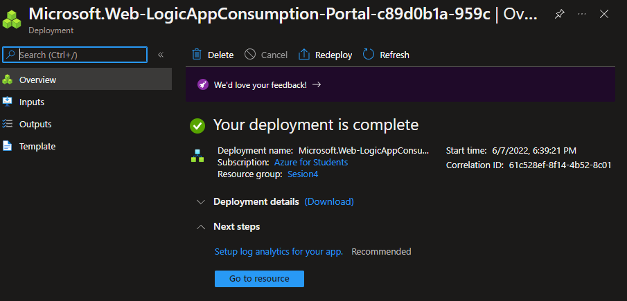
##### **NOTA: cuando entramos al recurso, no tendremos la vista normal**

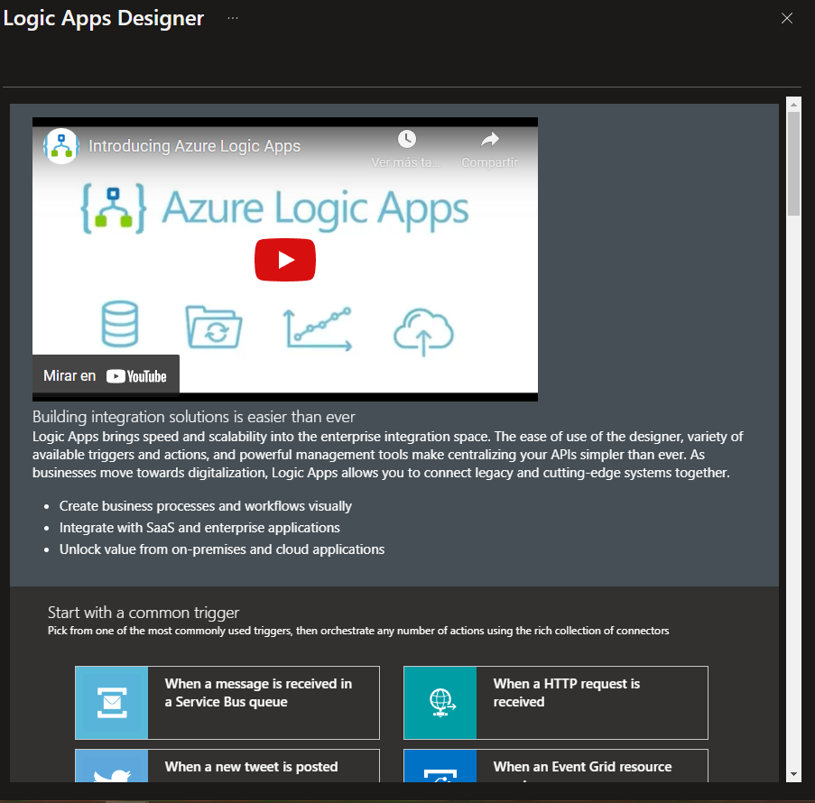

9.- Una ves que este listo, abriremos en otra pestala el portal de Azure y buscaremos**Cognitive Services**, aca es donde crearemos un lenguaje pero antes que eso, debemos crear un **Logic App** en blanco

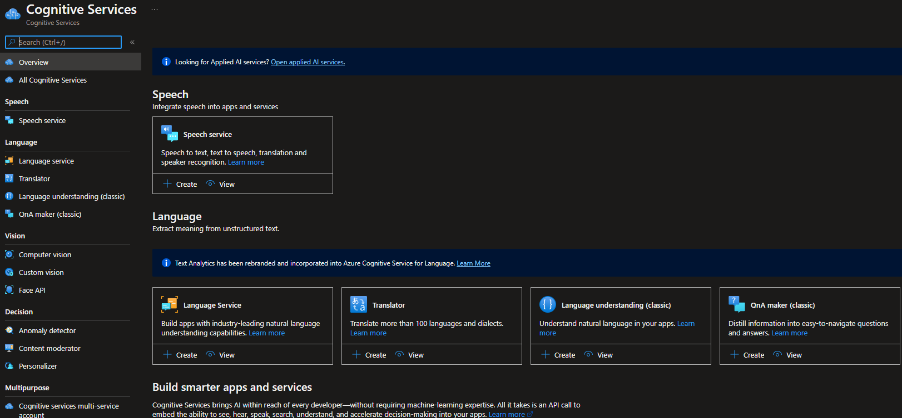

10.- Ahora creamos un Logic App en blanco.

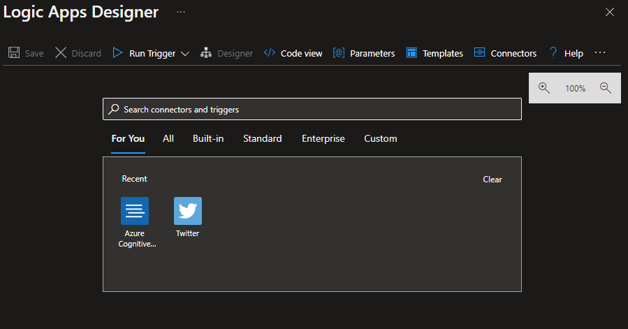

11.- Aca tenemos un desencadenador o trigger de evento

12.- buscamos Twitter y una ves que nos aparezca, la seleccionamos y iniciamos sesion.

13.- Ahora escriimos **#iawizards** y ponemos que la busqueda sera **cada 5 segundos**, despues le damos Next Step 

14.- buscamos la palabra **text** y buscamos la que dice **sentiment** (estos son los triggers que le estamos agregando).

15.- Por otro lago nos vamos a cognitive services y creamos uno que se llama language service
 
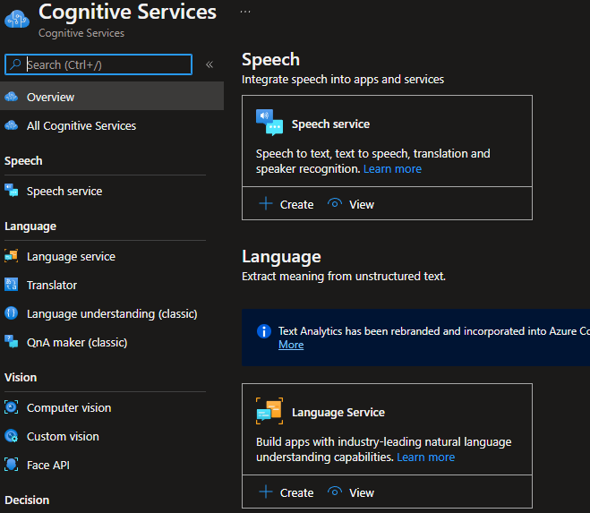

16.- creamos un language service.

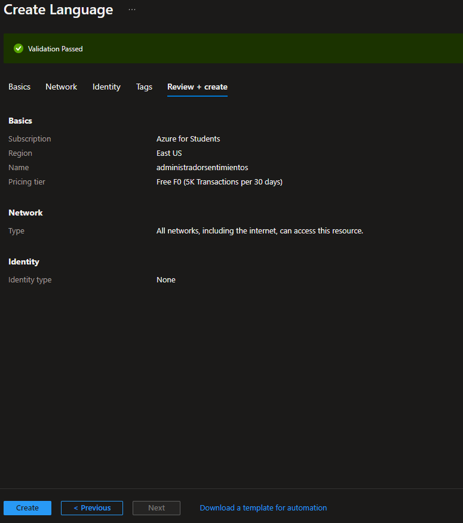

17.- Una ves creado nos vamos al recurso.

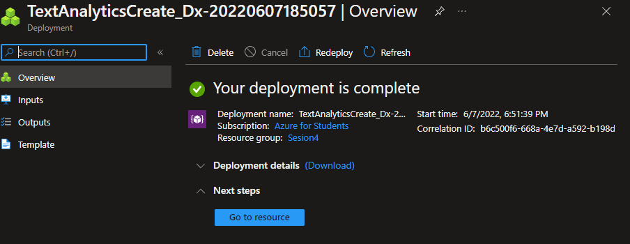

18.- buscamos la seccion claves y punto final, copiamos la primer clave.

19.- Regresamos donde estabamos creando lo del texto y pegamos la clave que nos habian dado.

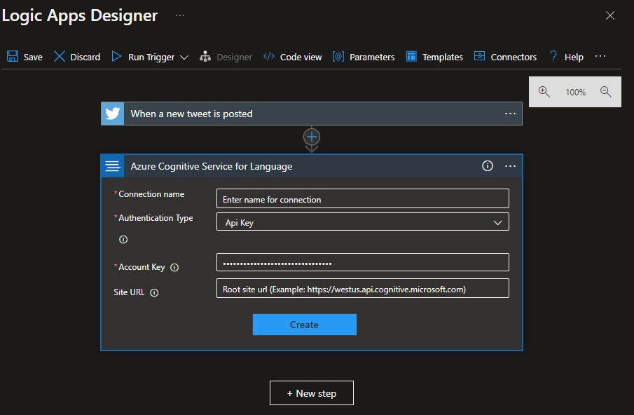

20.- Nos regresamos a donde habiamos copiado la clave y copiamos tambien la URL que nos proporciona, para volver a donde habiamos metido la clave para pegar el URL que nos dieron y crearlo.

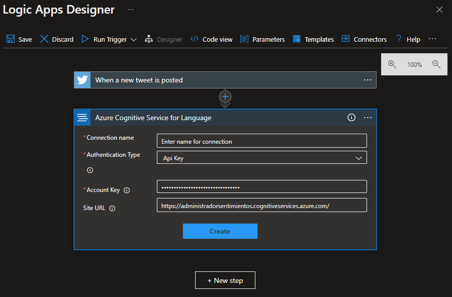

21.- Cuando lo creamos, nos pedira un Document Id, le ponemos que sea **Tweet id** y en la parte de documents text, le ponemos **tweet teext**, y vamos al siguiente paso.

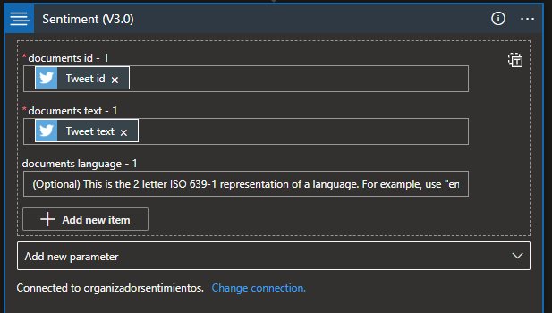

22.- Ahora buscamos Google sheets y le damos insertar fila.

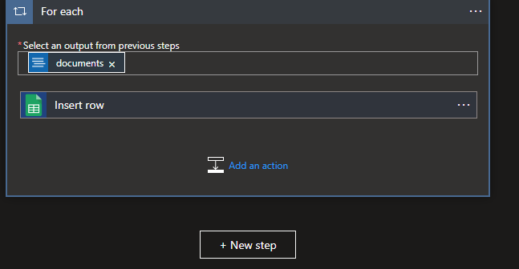

23.- Nos enlazara a One Drive, donde debemos crear una hoja de Calculos y agregamos los parametros.

24.- le agregamos los mismo recursos de las cosas que habiamos agregado como id del tweet y demas.

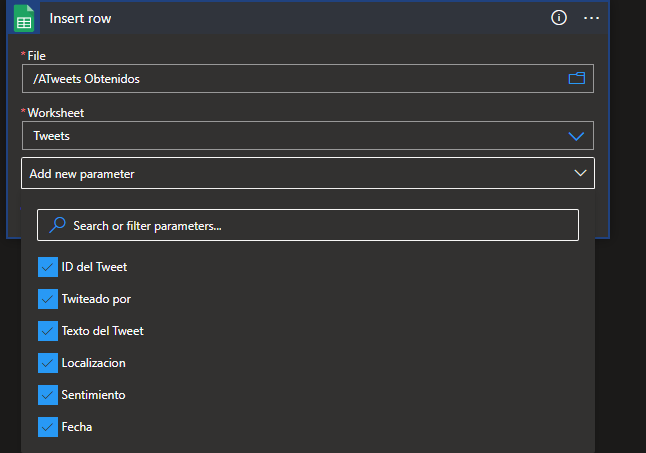

25.- agregamos una nueva accion

26.- Buscamos un trigger de Microsoft teams, que diga publicar mensaje en un canal o chat, lo que hara que pida iniciar sesion para sincronizar.

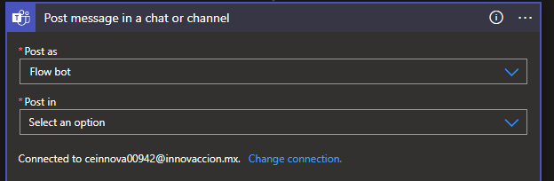

27.- Ahora le ponemos que se publique en un canal, buscamos el equipo y el canal donde lo haremos.

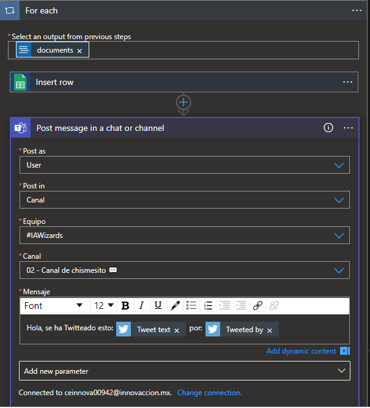

29.- ahora nos vamos a Twitter

30.- Y escribimos un Tweet con el **#iawizards**

31.- Lo que hara a continuacion es que nos mostrara ese tweet en la hoja de datos de excel y tambien en la propia aplicacion.

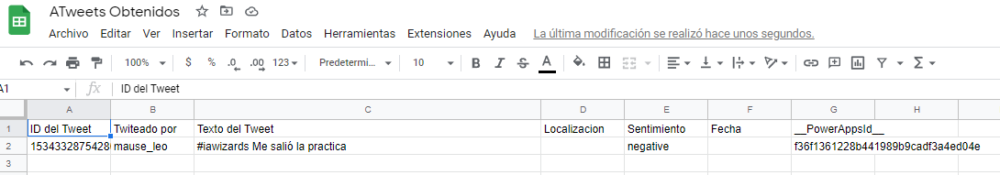

32.- Por ultimo podemos ir a checar tambien a Teams, donde nos mostrara que creamos nosotros un Tweet y el nombre de usuario nuestro.

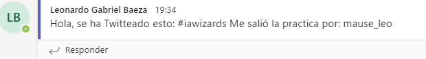

------------------------------------------------------------------------------
